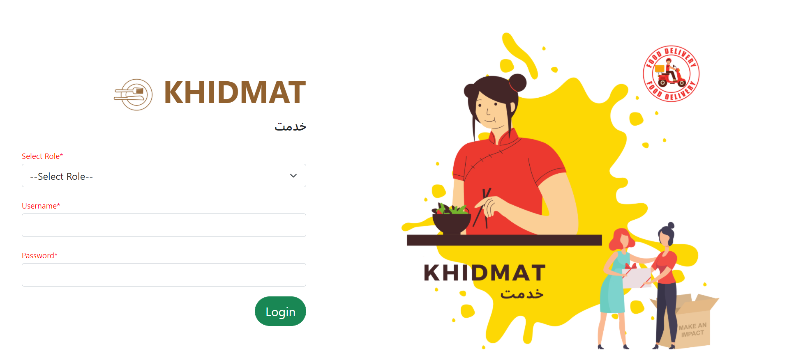
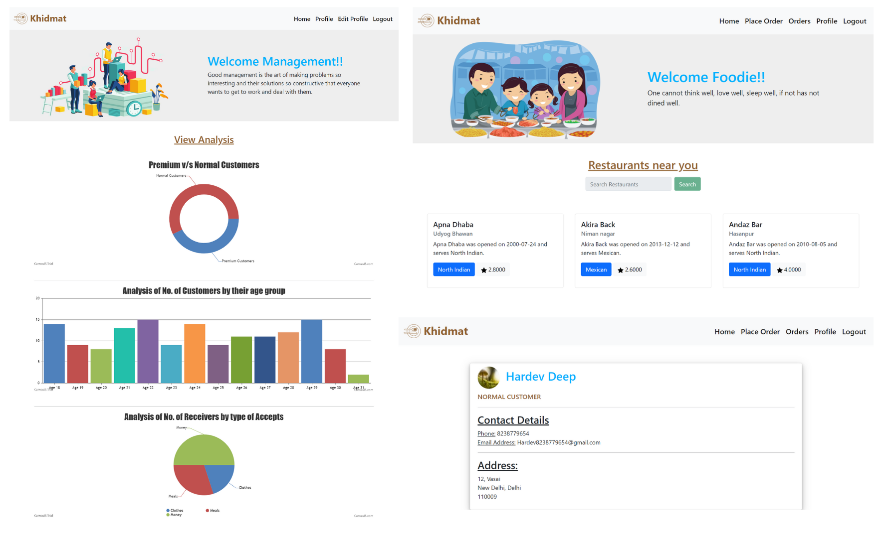
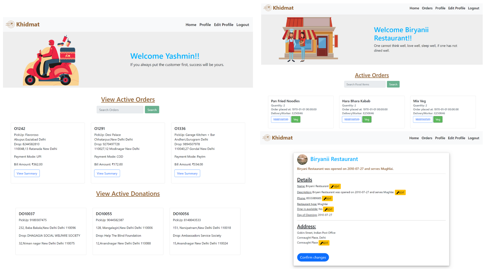
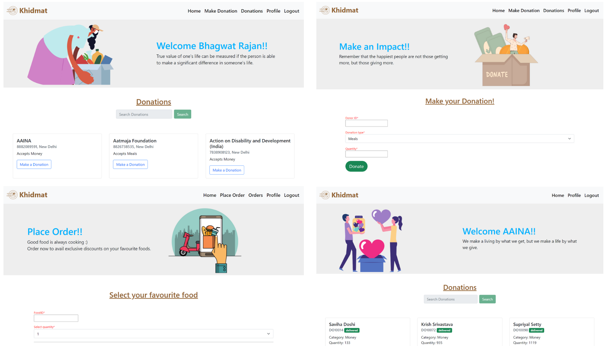

<h1> 
  Khidmat Database
   
</h1>

    

## About the Project 🚀
Khidmat is a food delivery app that connects customers with multiple restaurants and displays their menus, user-ratings and provides a vast number of food delivery options. The database centralizes the operations of Khidmat and provides a smooth user interface wherein donors can easily donate items without any hassle, and the users can select and order from the best restaurants with unbiased ratings from other customers who have ordered before.

Through this project, we aim to reduce food wastage and help the organizations which work for the welfare of people get easier access to resources and create a platform that incentivizes and makes it easy to donate.

Made as a part of project in Database Management System course at IIIT-Delhi.

## Setup 🤓

- First load the data on your system
- `pip3 install -r requirements.txt`
- `python3 app.py`

After making changes in the code, make sure to run `pip3 freeze > requirements.txt` and push changes to Github :)

#### Load MySQL data on your system

In order to create generate the .sql file on updating the database, run the command:
`mysqldump -u <username> -p khidmatDB > database.sql`

In order to load the database on your system:
- Create khidmatDB, if not already present by `CREATE DATABASE khidmatDB` in MySQL.
- Load the contents of the dump file with the command `mysql -u <username> -p khidmatDB < database.sql`

## Screenshots of the Application 📸

    

    

    

*Contact us:*

🎧 [Nandika Jain](https://github.com/nandikajain)  
💻 [Aairah Bari](https://github.com/Aairah-iiitd)  
🏀 [Manas Gupta](https://github.com/Manas2030)  
