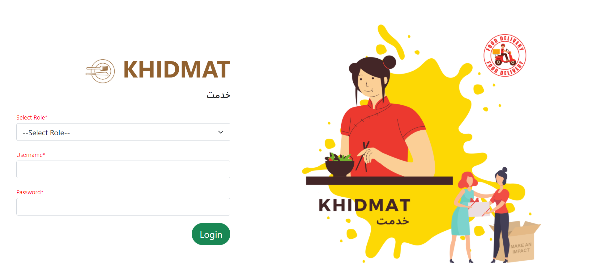

<h1> 
  Khidmat Database
   
</h1>

    

#### Run app on your system:

- First load the data on your system
- `pip3 install -r requirements.txt`
- `python3 app.py`

After making changes in the code, make sure to run `pip3 freeze > requirements.txt` and push changes to Github :)

#### Load MySQL data on your system:

In order to create generate the .sql file on updating the database, run the command:
`mysqldump -u <username> -p khidmatDB > database.sql`

In order to load the database on your system:
- Create khidmatDB, if not already present by `CREATE DATABASE khidmatDB` in MySQL.
- Load the contents of the dump file with the command `mysql -u <username> -p khidmatDB < database.sql`

  
